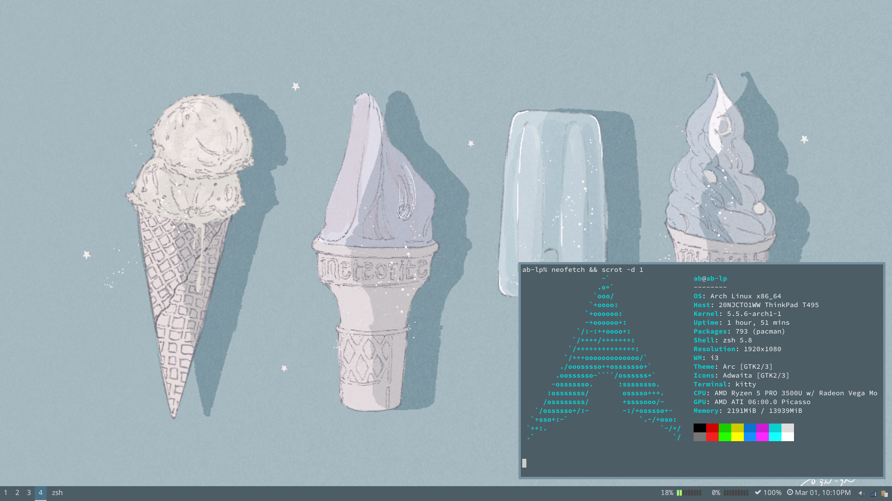

dotfiles
--------
My configurations, etc

# Based on:
- my old manjaro dotfiles (see branch old-manjaro)
- wallpaper source: https://www.pixiv.net/en/artworks/75339956

# Things used:
A list of some of the key things I use for my setup:
- fonts:
	- noto-fonts
	- noto-fonts-cjk
	- ttf-twemoji-color
	- awesome-terminal-fonts
- network:
	- NetworkManager
	- network-manager-applet
- audio:
	- pulseaudio
	- pavucontrol
	- pa-applet-git
- UI:
	- i3-gaps - wm
	- polybar - status bar
	- rofi - program launcher
	- dunst - notifications
	- lightdm - greeter
	- compton - compositor
- util programs:
	- htop - task manager
	- clipit - clipboard manager
	- settings and stuff:
		- lxappearance - gtk settings
		- qt5ct - qt settings
		- nitrogen - wallpaper
		- xfce4-power-manager - power management
		- lightdm-gtk-greeter-settings - greeter settings
- applications:
	- qpdfview - pdf viewer
	- vscodium-bin - code editor
	- intellij-idea-ultimate-edition - IDE
	- dolphin - file manager
	- qview - image viewer
	- firefox - web browser
	- mousepad - text editor
	- vim - vim
	- kitty - terminal
- other info:
	- shell: zsh
	- gtk theme: Arc

